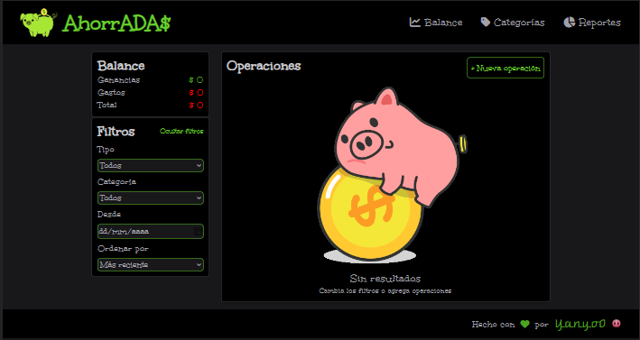
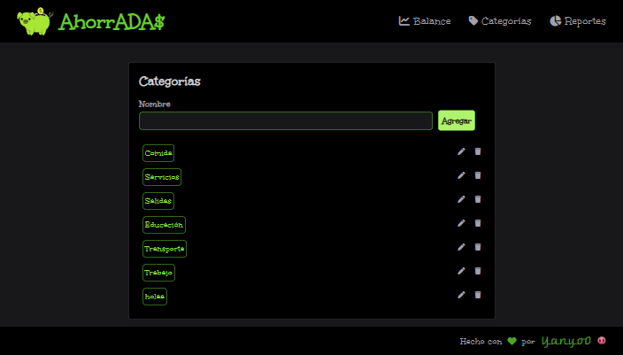
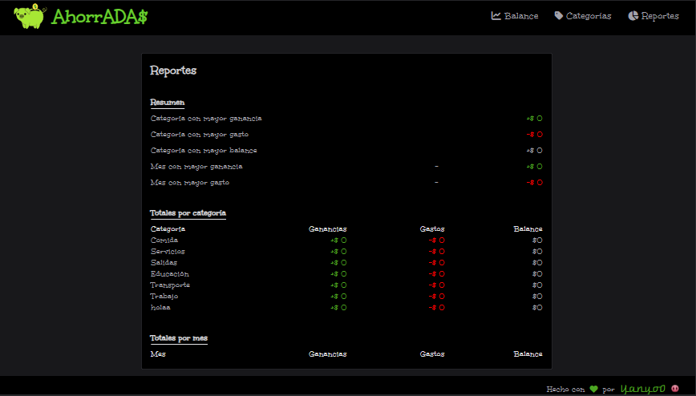
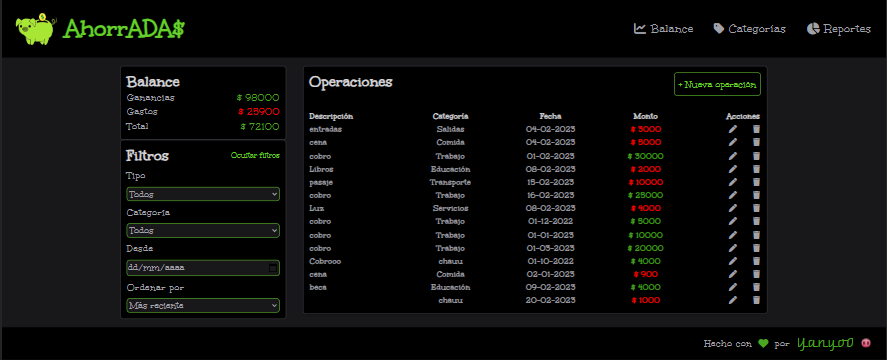
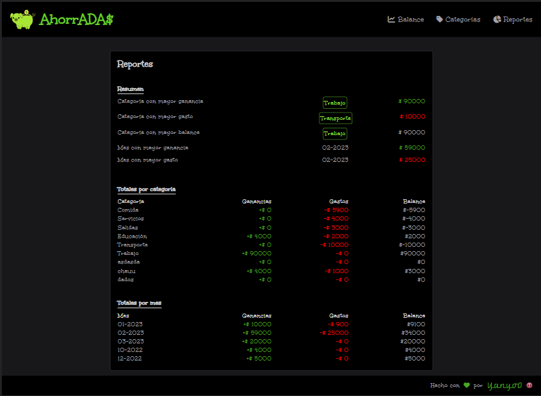

# AhorrADA$

### Hola! Bienvenido 3er trabajo de JavaScript

## Sobre mi proyecto

Ahorradas es una App de control de gastos, donde podes ir registrando los ingresos o egresos de dinero, separarlos por categorias(podes crear nuevas) y apuntar la fecha de tal operación. Tambien cuenta con una sección de reportes, con información detallada sobre las categorias y balances por mes.

### Sección Balances

### Sección Categoría

### Sección Registros

## Temas abordados en mi proyecto

- Manipulación del DOM
- Array y objetos
- LocalStorage
- CRUD
- Tailwind (framework CSS)

##Interfaz de app con datos ingresados

### Sección balances 

En la siguiente imagen podemos observar en la esquina superior izquierda un balance general de todas las operaciones ingresadas, mostrando todos los gastos, ganancias y un promedio entre ambos.

Debajo nos encontramos con la sección filtros, que genera una busqueda con los patrones especificados, y los muestra en la sección Operaciones que se encuentra a la derecha. De no especificar ningun tipo de filtrado, la sección mostrara todas las operaciones ingresadas hasta el momento. Cada operación cuenta con su propio boton de eliminar y editar.

### Sección Categorías

En esta sección muestra las categorías por las que se dividen las operaciones. La app trae por defecto un conjunto de ellas, de ser necesarias otras, tenes la opción de crear nuevas, tambien de editarlas y eliminarlas. (Podes observalo en la imagen mas arriba)

### Sección Reportes

Una vez ingresados los datos de las operaciones, esta sección genera un reporte de los datos ingresados hasta el momento.

### Te invito a ver mi App de AhorrADA$

[Click aqui](https://yanyo0.github.io/Ahorradas/)

*Espero lo disfrutes!*     

### Atte. Yanyo0 🐽

